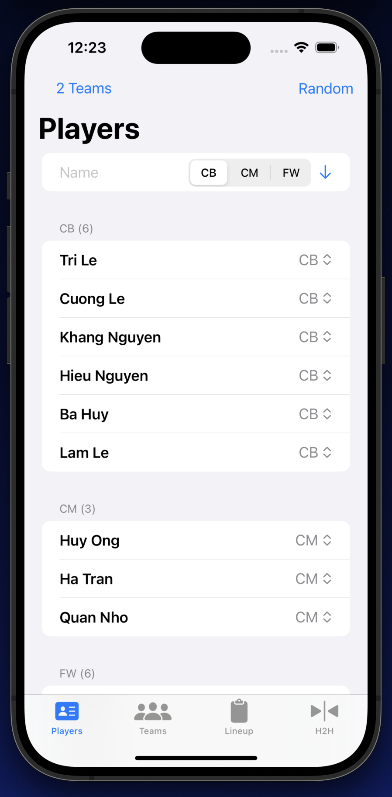

# VGS - Viet Golden State Soccer App

## Overview

Welcome to the **VGS** (Viet Golden State Soccer) app, your ultimate companion for managing soccer players and organizing teams in the Bay Area. This app is designed to streamline the process of player management, team distribution, lineup creation, and head-to-head match tracking for your soccer games.

## Features

### Player Management

- Easily keep track of all your soccer players, including their names, positions, and other relevant details.
- Organize player information efficiently, ensuring you have the latest updates on your squad.

### Team Distribution

- Create teams with flexibility, distributing players equally among teams of 2, 3, or 4 players.
- Optimize team composition based on player positions and skill levels to enhance the gaming experience.

### Whiteboard for Lineup Players

- Plan your game strategy with a built-in whiteboard feature.
- Arrange players on the field by dragging and dropping them into your desired positions, visualizing your team's formation.

### Head-to-Head View

- Track head-to-head matches with ease.
- Record scores, game details, and player performance to analyze game statistics and improve your team's performance.

## Getting Started

To get started with the **VGS** app, follow these steps:

1. **Installation**: Download and install the app on your preferred platform (iOS, Android, or web).

2. **Player Setup**: Add your players' information, including their names and positions, to the app's player database.

3. **Team Creation**: Create teams for your soccer games, specifying the team size (2, 3, or 4 players) and distributing players accordingly.

4. **Lineup Planning**: Utilize the whiteboard feature to plan your team's lineup and strategy.

5. **Match Tracking**: During matches, use the head-to-head view to record scores and game details.

## Feedback and Support

We value your feedback and suggestions. If you encounter any issues, have feature requests, or need assistance, please reach out to our support team at support@vgsoccerapp.com.

## License

This app is available under the [MIT License](LICENSE.md). Feel free to use, modify, and distribute it in accordance with the terms of the license.

Thank you for choosing **VGS** for your soccer management needs. We hope you enjoy the app and have a fantastic soccer experience in the Bay Area!

